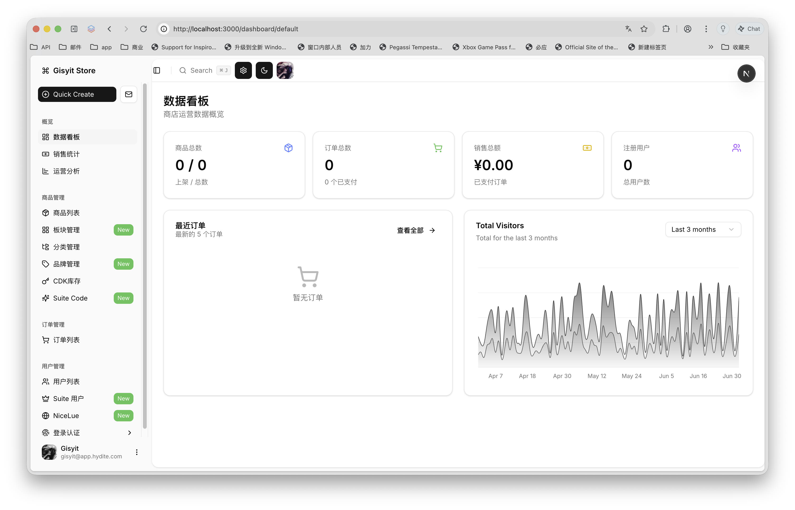
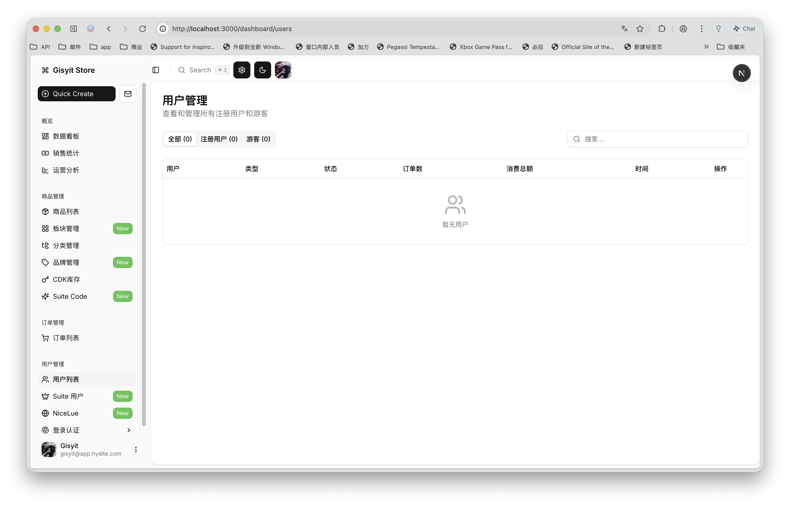
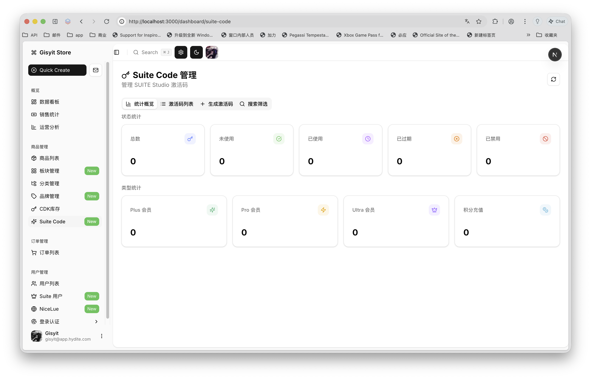
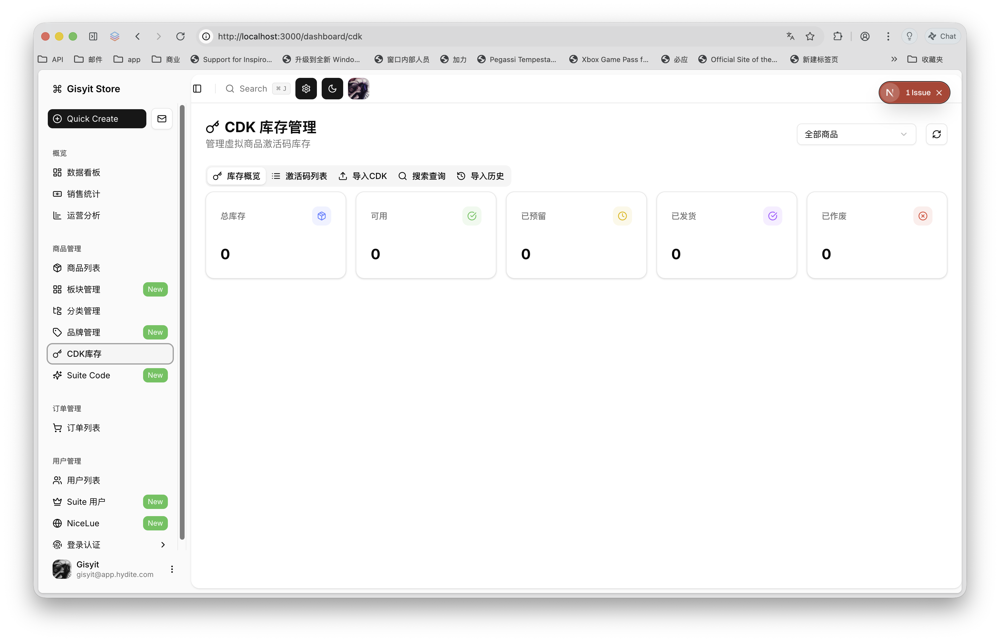
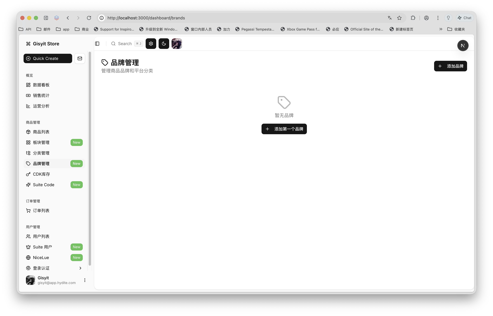

# 🎛️ Gisyit Studio Admin — E-Commerce Management Dashboard

A comprehensive, production-grade management dashboard designed for **Gisyit Shop**. This repository serves as the centralized administrative panel to manage orders, products, inventories, CDK license keys, categories, and customer profiles.

Built on **Next.js 16** and **React 19**, powered by **Supabase** backend services, and packaged as a cross-platform desktop application using **Electron**.

---

## 🔗 Associated Storefront
This dashboard works in conjunction with the primary storefront repository:
- 🏪 **Gisyit Shop Storefront**: [https://github.com/Aiomx/Gisyit-Shop](https://github.com/Aiomx/Gisyit-Shop)

---

## � Dashboard Previews

Here are some high-fidelity interface previews of the **Gisyit Studio Admin** application:

<p align="center">
  
  <br>
  <strong>Figure 1: Comprehensive analytics dashboard showcasing real-time sales, order stats, active products, and visual trend charts.</strong>
</p>

<p align="center">
  
  <br>
  <strong>Figure 2: Store Section and category manager featuring intuitive layouts for controlling department directories.</strong>
</p>

<p align="center">
  
  <br>
  <strong>Figure 3: Interactive category layout manager with smooth drag-and-drop sort order capabilities powered by @dnd-kit.</strong>
</p>

<p align="center">
  
  <br>
  <strong>Figure 4: Secure CDK license inventory dashboard with dynamic search, batch import status, and reservation timelines.</strong>
</p>

<p align="center">
  
  <br>
  <strong>Figure 5: Detailed order list and inspector panel for tracking payment completions and managing automated CDK delivery state machines.</strong>
</p>

---

## �🚀 Key Features

- **📊 Comprehensive Analytics**: Data visualizations and charts of sales, orders, and products powered by `recharts`.
- **📦 Catalog & Inventory Control**: Unified console for physical goods, application files, and global personal shopper items.
- **🔑 CDK / License Engine**: Automated generation, tracking, and validation tools for digital keys.
- **🛒 Order & Payment Tracker**: Interactive grid layouts featuring advanced status state machines (`pending`, `paid`, `fulfilled`, `cancelled`).
- **🔀 Drag-and-Drop Ordering**: Fully interactive interface with smooth item and shelf ordering powered by `@dnd-kit`.
- **💻 Desktop App Packaging**: Cross-platform desktop builds using **Electron** and **Electron-builder**, featuring a frameless border with customized OS-level window controller components.
- **⚡ Performance-First Architecture**: Styled with **Tailwind CSS v4**, robust data state management via **TanStack React Query**, and highly efficient tables with **TanStack Table**.

---

## ⚙️ Configuration & Environment Setup

The Studio Admin panel interacts with the exact same Supabase database and payment gateways as the main Gisyit Shop storefront.

Create a `.env.local` file in the root of the `dash` folder and supply the matching storefront environment credentials:

```ini
# Supabase Database Configuration
NEXT_PUBLIC_SUPABASE_URL=https://your-supabase-project.supabase.co
NEXT_PUBLIC_SUPABASE_ANON_KEY=your-supabase-anonymous-key

# Stripe Payment Keys
STRIPE_SECRET_KEY=sk_test_...
STRIPE_WEBHOOK_SECRET=whsec_...

# AI Models (Optional)
DEEPSEEK_API_KEY=your-deepseek-api-key
```

---

## 🛠️ Getting Started

### Prerequisites

- **Node.js** v20 or higher
- **npm** (v10+)

### 1. Installation

Install all required web and desktop dependencies:

```bash
npm install
```

### 2. Run in Web Development Mode

Start the local Next.js development server:

```bash
npm run dev
```

Your web dashboard will be available at **`http://localhost:3000`**.

### 3. Run in Desktop Development Mode (Electron)

To run the application inside the Electron wrapper during development:

1. In your first terminal, start the Next.js web server:
   ```bash
   npm run dev
   ```
2. In a second terminal, launch the Electron container:
   ```bash
   npm run electron:dev
   ```

---

## 🧹 Linting & Formatting

We use **Biome** for lightning-fast linting, formatting, and analysis:

- **Check and lint code**:
  ```bash
  npm run check
  ```
- **Auto-fix errors**:
  ```bash
  npm run check:fix
  ```
- **Format codebase**:
  ```bash
  npm run format
  ```

---

## 📦 Production Builds & Packaging

### Web Production Build

Build the optimized web bundles:

```bash
npm run build
```

Start the standard production Next.js server:

```bash
npm run start
```

### Electron Desktop App Packaging

To bundle the Next.js application into a production-ready, distributable desktop application (`.exe`, `.dmg`, or `.AppImage` outputs will be saved in `dist-electron/`):

- **Package for Active OS**:
  ```bash
  npm run electron:build
  ```
- **Package for Windows (`.exe`)**:
  ```bash
  npm run electron:build:win
  ```
- **Package for macOS (`.dmg`)**:
  ```bash
  npm run electron:build:mac
  ```
- **Package for Linux (`.AppImage`)**:
  ```bash
  npm run electron:build:linux
  ```

---

Built with ❤️ by the Gisyit Shop Team.
